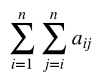

# parcial1AnalisisNumerico

## 1 
### <a name='1a'></a>

El algoritmo usado para sumar los elementos de la matriz superior es el siguiente, el cual recibe una matriz cuadrada:
```python
def sum_sup(A):
	cum = 0
	for i in range(len(A)):
		for j in range(i,len(A)):
			cum += A[i][j]
	return cum
```

### b
Para contar el numero de operaciones se utiliza la clase `SumCounter`:
```python
class SumCounter():
	def __init__(self):
		self.counter = 0
	def reset(self):
		self.counter = 0
	def sum(self,a,b):
		self.counter += 1
		return a + b
```
El cual debe llamar la funcion `sum()` cada vez que se realice una suma para aumentar el contador. Por lo que el algoritmo original se cambia a `cum = SumCounter.sum(A[i][j],cum)` para que realize el conteo de operaciones.

Del mismo modo se utiliza la clase `StopWatch`:
```python
class StopWatch():
	start_time = 0
	def __init__(self):
		self.start_time = 0
	@staticmethod
	def reset():
		self.start_time = time.time()
	@staticmethod
	def time():
		return time.time() - start_time
```

El cual debe reiniciarse cada vez que se va a medir el tiempo. Y la función `time()` da el valor transcurrido en segundos desde el último llamado a la función `reset()`.

Los resultados con diferentes valores son los siguientes:


n | Tiempo | Operaciones 
------------ | ------------- | -------------  
4 | 3.69e-05 | 10
5 |  3.98e-05 | 15
10| 0.0002 | 55
20| 0.0004 | 120
100|  0.007 | 5050

### c (CORRECCIÓN)
En este punto se corrige lo puesto en el parcial.

Viendo el algoritmo en [1a](#1a) se puede ver directamente que las sumas realizadas son de la forma:



E

## 2


Se utilizo la siguiente funcion para calcular el polinomio de grado n para el polinomio dado, el cual recibe la `x`a evaluar, el grado del polinomio `n` y el valor del polinomio del grado anterior `Pn_1`.

```r
suc_taylor_n <- function(x,n,Pn_1) {
	y <- x^n/factorial(n) + Pn_1
	if (n == 0) y <- x
	y
}
```

La siguiente función calcula el metodo de atiken dados los terminos necesarios

```r
suc_atiken_n <- function(P_2n,P_1n,P_n) {
	P_n - (P_1n - P_n)^2/(P_2n - 2*P_1n + P_n)
}
```


finalmente se utilizó la siguiente función para calcular el n-esimo `n` termino de método atiken, para un valor de `x` asumiento todos la función dada en el parcial.
```python
atiken_n <- function(n,x) {
	P_n <- suc_taylor_n(x,0,0)
	P_1n <- suc_taylor_n(x,1,P_n)
	P_2n <- suc_taylor_n(x,2,P_1n)
	taylor_k <- 3
	atiken_k <- 0
	while (atiken_k < n) {
		At <- suc_atiken_n(P_2n,P_1n,P_n)

		# polinomios taylor grado n
		P_n <- P_1n 
		P_1n <- P_2n
		P_2n <-suc_taylor_n(x,taylor_k,P_2n)

		# contadores
		taylor_k <- taylor_k + 1
		atiken_k <- atiken_k + 1
	}
	At
}
```
