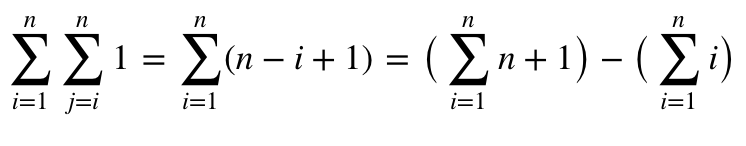
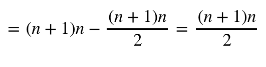
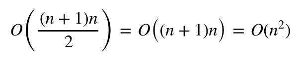

# parcial1AnalisisNumerico

## 1 
### <a name='1a'></a>

El algoritmo usado para sumar los elementos de la matriz superior es el siguiente, el cual recibe una matriz cuadrada:
```python
def sum_sup(A):
	cum = 0
	for i in range(len(A)):
		for j in range(i,len(A)):
			cum += A[i][j]
	return cum
```

### b
Para contar el numero de operaciones se utiliza la clase `SumCounter`:
```python
class SumCounter():
	def __init__(self):
		self.counter = 0
	def reset(self):
		self.counter = 0
	def sum(self,a,b):
		self.counter += 1
		return a + b
```
El cual debe llamar la funcion `sum()` cada vez que se realice una suma para aumentar el contador. Por lo que el algoritmo original se cambia a `cum = SumCounter.sum(A[i][j],cum)` para que realize el conteo de operaciones.

Del mismo modo se utiliza la clase `StopWatch`:
```python
class StopWatch():
	start_time = 0
	def __init__(self):
		self.start_time = 0
	@staticmethod
	def reset():
		self.start_time = time.time()
	@staticmethod
	def time():
		return time.time() - start_time
```

El cual debe reiniciarse cada vez que se va a medir el tiempo. Y la función `time()` da el valor transcurrido en segundos desde el último llamado a la función `reset()`.

Los resultados con diferentes valores son los siguientes:


n | Tiempo | Operaciones 
------------ | ------------- | -------------  
4 | 3.69e-05 | 10
5 |  3.98e-05 | 15
10| 0.0002 | 55
20| 0.0004 | 120
100|  0.007 | 5050

### c (CORRECCIÓN)
En este punto se corrige lo puesto en el parcial.

Viendo el algoritmo en [1a](#1a) se puede ver directamente que las sumas realizadas son de la forma:


Debido a que las únicas operaciones realizadas son sumas, si reemplazamos `a_ij` por `1` tendremos las sumas realizadas.




Si se quiere expresar en notación `O(n)` se debe tener en cuenta que este no tiene en cuenta constantes y que `O(n^2 + n) = O(n^2)` debido a que el término al cuadrado crece mucho mas rápido que el otro.



Por lo que se puede decir que tiene un tiempo de complejidad cuadráditica.

## 2


Se utilizó la siguiente funcion para calcular el polinomio de grado n para la función exponencial, el cual recibe la `x` a evaluar, el grado del polinomio `n` y el valor del polinomio del grado anterior `Pn_1`:

```r
suc_taylor_n <- function(x,n,Pn_1) {
	y <- x^n/factorial(n) + Pn_1
	if (n == 0) y <- x
	y
}
```

La siguiente función calcula el metodo de atiken dados los terminos `p_n+1,p_n+2,p_n` de la función original. y arroja el n-ésimo término de la sucesión de Atiken.

```r
suc_atiken_n <- function(P_2n,P_1n,P_n) {
	P_n - (P_1n - P_n)^2/(P_2n - 2*P_1n + P_n)
}
```


Finalmente se utilizó la siguiente función para calcular el n-esimo `n` término de método Atiken, para un valor de `x` asumiendo una formula de taylor dada:
```python
atiken_n <- function(n,x) {
	P_n <- suc_taylor_n(x,0,0)
	P_1n <- suc_taylor_n(x,1,P_n)
	P_2n <- suc_taylor_n(x,2,P_1n)
	taylor_k <- 3
	atiken_k <- 0

	# ayuda para convergencia
	At_1 <- suc_atiken_n(P_2n,P_1n,P_n)
	while (atiken_k < n) {
		At <- suc_atiken_n(P_2n,P_1n,P_n)

		# polinomios taylor grado n
		P_n <- P_1n 
		P_1n <- P_2n
		P_2n <-suc_taylor_n(x,taylor_k,P_2n)

		# contadores
		taylor_k <- taylor_k + 1
		atiken_k <- atiken_k + 1

		# convergencia
		print(paste('convergencia: ',abs(At-exp(1))/abs(At_1-exp(1))^1))
		At_1 <- At
	}
	At
}
```

Dividiendo los dos ultimos valores de atiken vemos que estos tienden a `1` como se muestran en la siguiente tabla, por lo tanto la sucesión converge de forma lineal

iteración | p_n/p_{n-1}
------------ | ----------  
1 | 0.916666
2 |  0.989898
3|  0.998724
4| 0.99985
5|  0.99998

## 3
### a
La función secante implementada es la siguiente, recibe la función `f` de la cual se quiere encontrar la raíz, dos puntos iniciales `x1` y `x2`, y un error permitido:
```R
secant <- function(f,x1,x2,E) {
	pn_1 <- x1
	pn_2 <- x2
	while (abs(f(pn_1)) > E) {
		pn <- pn_1 - (f(pn_1)*(pn_1 - pn_2))/(f(pn_1) - f(pn_2))
		pn_2 <- pn_1
		pn_1 <- pn
	}
	pn_1
}
```

la función de entrada es `log(x+2) - sin(x)`, y con un error de `1e-7` se tiene que:
```
x = -1.63144
f(x) = -2.67786515184554e-09
```
### b 
El algoritmo de newton generalizado esta implementado de la siguiente manera:
```R
newton_g <- function(f,x0,E) {
	# derivadas
	df <- function(x) {}
	body(df) <- D(body(f),'x')
	ddf <- function(x) {}
	body(ddf) <- D(body(df),'x')

	x <- x0
	while (abs(f(x)) > E) {
		x <- x - f(x)*df(x)/(ddf(x)^2 - f(x)*ddf(x))
	}
	x
}
```
Esta recibe la función a evaluar `f` un punto de inicio `x0` y un error `E`, si se evalua la función con un error de `1e-5` se tiene:
```
x = -1.63144717270178
f(x) = -9.91877537448449e-06
```
